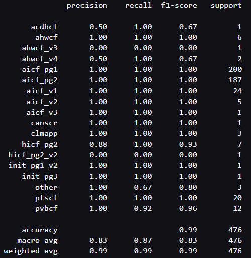

# Offline_cf_classification

## Models for classifying offline claim forms using sentence encoding and distance metrics.

Templates are created for each online claim form by first extracting text using OCR and then encoding the text as an 1*x*512 vector representation. Encoded document templates are combined into a single template matrix.

Each newly uploaded offline claim form is encoded using the same method. A distance is then computed between the new form and the template matrix using cosine similarity. The template matrix row with the smallest distance to the uploaded form corresponds to the highest cosine similarity. The class label for this row is then used to predict the document class for the uploaded claim form.

### Run on Python 3 (Data Science 2.0) Sagemaker Studio kernel


Install requirements:
```
pip install -r requirements.txt
```

Create a n *x* m matrix of encoded claim form text for templates:
```
python create_template_main.py
```

You may need to unzip the testing dataset to run experiments:
```
python unzip_dataset.py
```

For experiments, run OCR to get text for all forms in dataset (avoids multiple calls):
```
python run_get_text_for_test.py
```

## Highest F1 score achieved with USE Small (Experiment 5)

